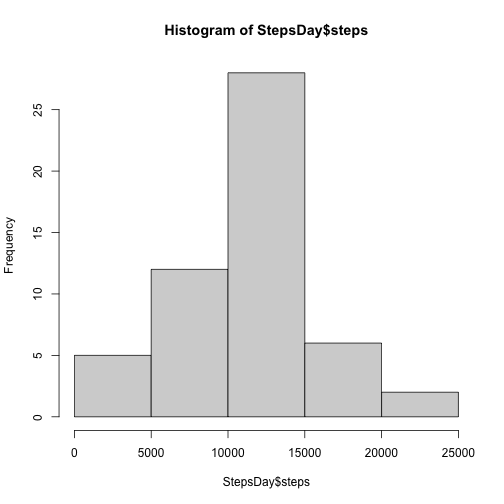
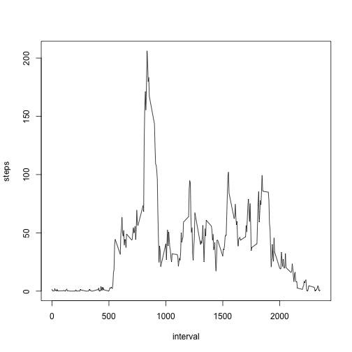
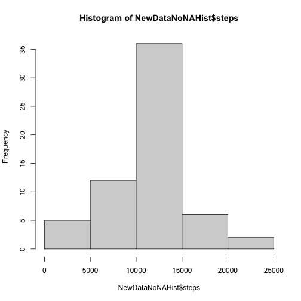
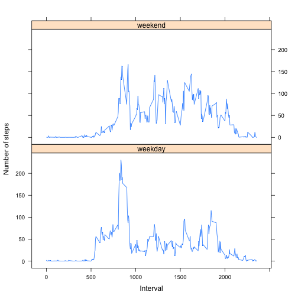

## Part 1

R Code for Reading the dataset and/or processing the data. First 'activity.zip' file is unziped with command unzip. File activity.csv is read using read.csv command. Summary and Str shows that we have NAs in variable step.


```r
unzip("./activity.zip")
DataActivity <- read.csv("./activity.csv")
summary(DataActivity)
```

```
##      steps            date              interval     
##  Min.   :  0.00   Length:17568       Min.   :   0.0  
##  1st Qu.:  0.00   Class :character   1st Qu.: 588.8  
##  Median :  0.00   Mode  :character   Median :1177.5  
##  Mean   : 37.38                      Mean   :1177.5  
##  3rd Qu.: 12.00                      3rd Qu.:1766.2  
##  Max.   :806.00                      Max.   :2355.0  
##  NA's   :2304
```

```r
str(DataActivity)
```

```
## 'data.frame':	17568 obs. of  3 variables:
##  $ steps   : int  NA NA NA NA NA NA NA NA NA NA ...
##  $ date    : chr  "2012-10-01" "2012-10-01" "2012-10-01" "2012-10-01" ...
##  $ interval: int  0 5 10 15 20 25 30 35 40 45 ...
```

## Part 2

Histogram of the total number of steps taken each day. Aggregate creates a dataframe using steps into date subsets.It has ignored the NAs in steps. 


```r
StepsDay <- aggregate(steps ~ date, DataActivity, FUN = sum, na.rm = TRUE)
hist(StepsDay$steps)
```



## Part 3
Mean and median number of steps taken each day using the frequencies. 


```r
meanStepsPerDay <- mean(StepsDay$steps)
meanStepsPerDay # Mean
```

```
## [1] 10766.19
```

```r
medianStepsPerDay <- median(StepsDay$steps)
medianStepsPerDay # Median
```

```
## [1] 10765
```
## Part 4

Time series plot of the average number of steps taken. 


```r
StepsPerInt<-aggregate(steps~interval, data=DataActivity, mean, na.rm=TRUE)
plot(steps~interval, data=StepsPerInt, type="l")
```



## Part 5

The 5-minute interval that, on average, contains the maximum number of steps. Which.max calculates the index in the dataframe that has the maximum number of steps (104).


```r
MaxInt <- StepsPerInt[which.max(StepsPerInt$steps),]$interval
MaxInt
```

```
## [1] 835
```
## Part 6

Code to describe and show a strategy for imputing missing data using the mean per interval.


```r
MeanPerInt <- function(interval) {
  StepsPerInt[StepsPerInt$interval==interval,]$steps
}

NewDataNoNA <- DataActivity
for(i in 1:nrow(NewDataNoNA)){
  if(is.na(NewDataNoNA[i,]$steps)){
    NewDataNoNA[i,]$steps <- MeanPerInt(NewDataNoNA[i,]$interval)
  }
}
```
## Part 7

Histogram of the total number of steps taken each day after missing values are imputed. 


```r
NewDataNoNAHist <- aggregate(steps ~ date, NewDataNoNA, sum)
hist(NewDataNoNAHist$steps)
```



## Part 8

Panel plot comparing the average number of steps taken per 5-minute interval across weekdays and weekends. 


```r
NewDataNoNA$date <- as.Date(strptime(NewDataNoNA$date, format="%Y-%m-%d"))
NewDataNoNA$day <- weekdays(NewDataNoNA$date)
for (i in 1:nrow(NewDataNoNA)) {
    if (NewDataNoNA[i,]$day %in% c("Saturday","Sunday")) {
        NewDataNoNA[i,]$day<-"weekend"
    }
    else{
        NewDataNoNA[i,]$day<-"weekday"
    }
}
StepsByDay <- aggregate(NewDataNoNA$steps ~ NewDataNoNA$interval + NewDataNoNA$day, NewDataNoNA, mean)
head(StepsByDay)
```

```
##   NewDataNoNA$interval NewDataNoNA$day NewDataNoNA$steps
## 1                    0         weekday        2.25115304
## 2                    5         weekday        0.44528302
## 3                   10         weekday        0.17316562
## 4                   15         weekday        0.19790356
## 5                   20         weekday        0.09895178
## 6                   25         weekday        1.59035639
```

```r
names(StepsByDay) <- c("interval", "day", "steps")
library(lattice)
xyplot(steps ~ interval | day, StepsByDay, type = "l", layout = c(1, 2), 
    xlab = "Interval", ylab = "Number of steps")
```




